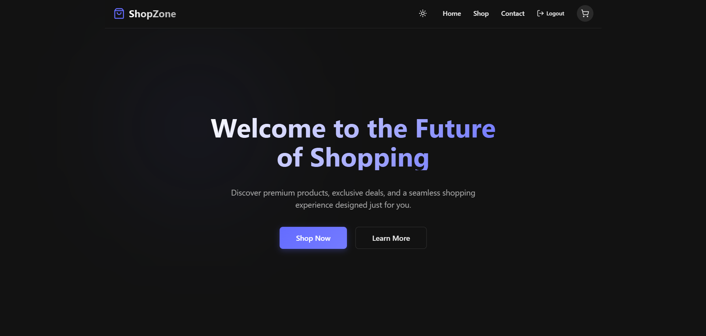
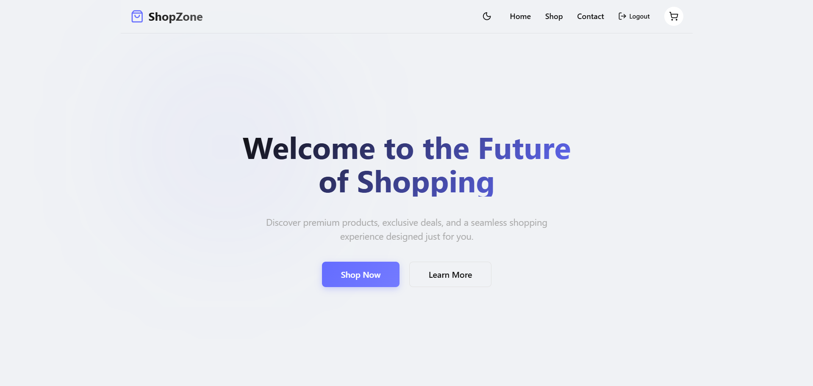

# ShopZone v2 - Advanced State Management Upgrade

A production-grade upgrade of the ShopZone E-Commerce SPA, migrating from Context API to **Redux Toolkit (RTK)** with `redux-persist`. Features enterprise-level global state management, advanced product filtering, render optimization with `useMemo` & `useCallback`, and a fully dynamic Dark/Light Theme Manager — all controlled through a centralized Redux store.

---

## 📑 Table of Contents
- [Preview](#-preview)
- [Demo](#-demo)
- [Features](#-features)
- [Technologies Used](#-technologies-used)
- [Installation](#-installation)
- [Usage](#-usage)
- [How It Works](#-how-it-works)
- [Redux Store Architecture](#-redux-store-architecture)
- [Responsive Design](#-responsive-design)
- [Acknowledgments](#-acknowledgments)
- [Contact](#-contact)

---

## 📸 Preview

| Desktop View - Dark Mode | Desktop View - Light Mode |
|:---:|:---:|
|  |  |

---

## 🚀 Demo
Check out the live version here:  
👉 **[Live Demo Link](https://shop-zone-eta.vercel.app/)**

---

## ✨ Features

- 🛒 **Redux-Powered Cart**: Shopping cart fully migrated to a Redux `cartSlice` with `addToCart`, `removeFromCart`, `updateQuantity`, and `clearCart` actions.
- 🔗 **Single Page Routing**: Seamless page transitions without reloading using React Router v7.
- 🗃️ **Enterprise State Management**: Redux Toolkit replaces all Context API usage. One centralized store manages cart, auth, filters, products, and theme.
- 💾 **Persistent State**: `redux-persist` ensures cart, auth session, and theme preference all survive page refreshes via `localStorage`.
- 🔍 **Advanced Product Filtering**: A dedicated Filter Sidebar lets users filter by Category, Price Range, Minimum Rating, and Sort Order — all stored in global Redux state.
- 🌗 **Dynamic Theme Manager**: A Sun/Moon toggle in the Navbar switches between Dark and Light mode instantly. Theme state lives in Redux and persists across sessions.
- ⚡ **Render Optimization**: `useMemo` prevents re-computation of filtered product lists. `useCallback` memoizes event handlers. `React.memo` wraps product cards to prevent unnecessary re-renders.
- 📱 **Fully Responsive**: Adapts elegantly across desktop and mobile screens using CSS Grid and Flexbox.
- 🎨 **Dual-Theme UI**: All styles use CSS custom properties (`--bg-primary`, `--text-primary`, etc.) that respond instantly to theme changes via `data-theme` attribute.

---

## 🛠 Technologies Used

-   **React 19**: Component-based UI library for building interactive interfaces.
-   **React Router v7**: For handling client-side routing (`BrowserRouter`, `Routes`, `Route`).
-   **Redux Toolkit (RTK)**: Modern industry-standard state management. Replaces all Context API usage.
-   **react-redux**: `useSelector` and `useDispatch` hooks to connect components to the Redux store.
-   **redux-persist**: Persists Redux store slices to `localStorage` so state survives page refresh.
-   **Vite**: Next-generation frontend tooling for an incredibly fast dev environment.
-   **Vanilla CSS with CSS Variables**: Custom properties power the dark/light theme system.
-   **Lucide React**: For sleek, scalable SVG icons including the theme toggle Sun/Moon.
-   **DummyJSON API**: Providing realistic mock product data with categories, ratings, and prices.

---

## 🚀 Installation

1.  **Clone the repository**:
    ```bash
    git clone https://github.com/AyushVyas3925/shopzone.git
    cd shopzone
    ```

2.  **Install Dependencies**:
    ```bash
    npm install
    npm install @reduxjs/toolkit react-redux redux-persist
    ```

3.  **Run the Development Server**:
    ```bash
    npm run dev
    ```
    *   The app will launch at `http://localhost:5173` (or similar).

4.  **Build for Production**:
    ```bash
    npm run build
    ```

5.  **Verify Redux is working**:
    *   Install the **Redux DevTools** Chrome extension.
    *   Open DevTools → Redux tab to see live state and action logs.

---

## 📖 Usage

1.  **Browse Shop**: Review the full product catalog fetched from the DummyJSON API.
2.  **Filter Products**: Use the Filter Sidebar to narrow products by Category, Price Range, Rating, or Sort Order.
3.  **Search**: Type in the search bar to instantly filter products by name in real time.
4.  **View Details**: Click "View Details" on any card to navigate to its dedicated product page.
5.  **Add to Cart**: Click "Add to Cart" on the product details page. The Navbar badge increments instantly.
6.  **Manage Cart**: Adjust item quantities with `+` / `−` controls or remove items entirely.
7.  **Toggle Theme**: Click the Sun/Moon icon in the Navbar to switch between Dark and Light mode.
8.  **Checkout**: Login as guest, then proceed to checkout. Cart is cleared automatically on order confirmation.

---

## 🧠 How It Works

1.  **Redux Store**: A single `store.js` using `configureStore` combines five slices — `cartSlice`, `authSlice`, `filterSlice`, `productsSlice`, and `themeSlice`. Wrapped with `redux-persist` to sync all state to `localStorage`.
2.  **Slices**: Each feature owns its state, reducers, and actions in one file. Components dispatch actions using `useDispatch()` and read state using `useSelector()`.
3.  **Async Data Fetching**: `productsSlice` uses `createAsyncThunk` to fetch all products from the DummyJSON API. Loading, success, and error states are managed inside the slice.
4.  **Filtering Logic**: `filterSlice` holds all active filter values. `Shop.jsx` reads them via `useSelector` and computes the filtered + sorted product list using `useMemo` — only recalculating when filters or products actually change.
5.  **Theme System**: `themeSlice` stores `"dark"` or `"light"`. `App.jsx` reads this and applies `data-theme="dark/light"` to the root element. All CSS uses custom properties (`--bg-primary`, `--text-primary`, etc.) that respond to the attribute instantly.
6.  **Dynamic Routing**: `ProductDetails` uses `useParams()` to extract the product `:id` from the URL and fetches that specific item from the DummyJSON API.

---

## 🗃️ Redux Store Architecture

```
src/store/
├── store.js                  ← configureStore + redux-persist setup
└── slices/
    ├── cartSlice.js           ← addToCart, removeFromCart, updateQuantity, clearCart
    ├── authSlice.js           ← login, logout
    ├── filterSlice.js         ← setCategory, setPriceRange, setMinRating, setSortBy, setSearchQuery, resetFilters
    ├── productsSlice.js       ← fetchProducts (createAsyncThunk)
    └── themeSlice.js          ← toggleTheme, setTheme
```

---

## 📱 Responsive Design

-   **Mobile**: The product grid drops to a single-column layout. The Filter Sidebar collapses above the grid for easy scrolling.
-   **Desktop**: CSS Grid with `auto-fill` and `minmax` rules creates a beautiful multi-column product catalog. The Filter Sidebar sits in a fixed-width left column.
-   **Adaptive**: All colors, backgrounds, and borders respond to the active theme via CSS custom properties, keeping both Dark and Light modes fully polished at every screen size.

---

## 👏 Acknowledgments

-   **Redux Toolkit Team**: For making modern Redux approachable and boilerplate-free.
-   **redux-persist**: For effortless state persistence to `localStorage`.
-   **DummyJSON**: For an incredibly easy-to-use e-commerce API.
-   **Vite**: For the unparalleled local development speed.
-   **React Router Team**: For providing seamless declarative routing.
-   **Lucide React**: For beautiful open-source iconography.

---

## 📬 Contact

**Ayush Vyas**

-   📧 Email: s.ayushvyas3925@gmail.com
-   🔗 LinkedIn: [Ayush Vyas](https://www.linkedin.com/in/ayush-vyas-287980286/)

---
*Created for the Week 10 Project — Advanced State Management Upgrade.*